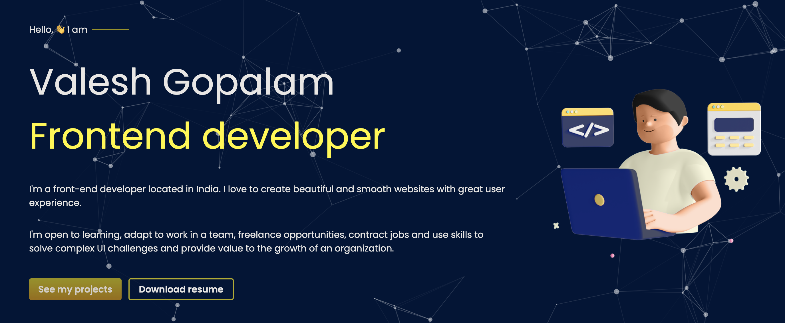

## Portfolio Website

## Table of contents

- [Overview](#overview)
  - [Screenshot](#screenshot)
  - [How to use?](#how-to-use)
  - [More Information](#more-information)
  - [Built with](#built-with)
- [Author](#author)

## Overview

What the website does:

- Displays the frontend projects I created which demonstrates my skills.

### Screenshot

### How to use ?

Go to https://valeshgopal.github.io

### More Information

This website is responsive.

### Built with

- HTML5
- CSS custom properties
- Vanilla JavaScript
- Responsive Design

## Author

Created By [Valesh Gopal](https://www.github.com/valeshgopal)

[Twitter](https://twitter.com/ValeshDev)
[Linkedin](https://linkedin.com/valeshgopal)
